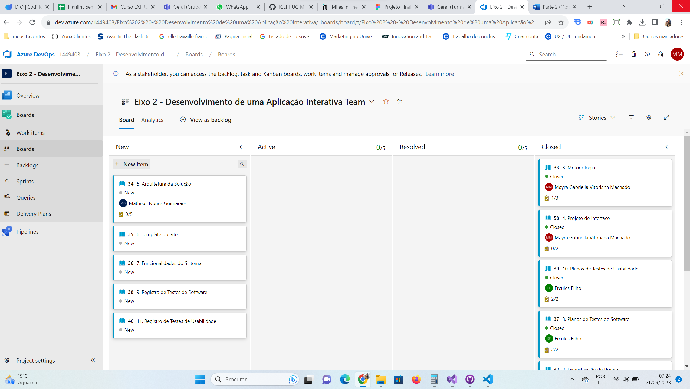

# Metodologia

Pré-requisitos: <a href="2-Especificação do Projeto.md"> Documentação de Especificação</a>

A metodologia de desenvolvimento de software é o esqueleto sobre o qual todo o processo de criação de aplicativos e sistemas é construído. Ela não apenas define as diretrizes e os passos a serem seguidos, mas também molda a maneira como uma equipe trabalha em conjunto para atingir metas e objetivos específicos. Para estabelecer uma base sólida para nossa abordagem, incorporamos um referencial teórico que fundamenta nossas práticas e decisões (Creswell, 2014; Yin, 2017). 

## Controle de Versão

Relação de Ambientes de Trabalho 

Os artefatos do projeto são desenvolvidos a partir de diversas plataformas e a relação dos ambientes com seu respectivo propósito é apresentado Abaixo:

Repositório de código fonte:
A ferramenta de controle de versão adotada no projeto foi o
[Git](https://git-scm.com/), sendo que o [Github](https://github.com/rommelcarneiro/tiaw-template )
foi utilizado para hospedagem do repositório.

Documentos do projeto: 

A ferramenta de controle de versão adotada no projeto foi o [Teams] (https://teams.microsoft.com/), sendo que o [Teams](https://teams.microsoft.com/_#/school/FileBrowserTabApp/Geral?threadId=19:Fyi9t9XMqoY5dNSGefrEu2Aj_NwSyUcp6JZ6k1a-uac1@thread.tacv2&ctx=channel)
foi utilizado para salvar os documentos do projeto.

Projeto de Interface e  Wireframes: 

A ferramenta de controle de versão adotada no projeto foi o [Figma] (https://www.figma.com/), sendo que o [Figma](https://www.figma.com/file/j8f1c93Odr0cVKPrZHeUSz/Projeto-Final?type=design&node-id=0-1&mode=design&t=Tth0q9nZ0IM1B5Ea-0  )
foi utilizado para criar a interface e Wireframes.

Gerenciamento do Projeto : 

A ferramenta de controle de versão adotada no projeto foi o [Azure] (https://dev.azure.com/), sendo que o [Azure](https://dev.azure.com/1449403/Eixo%202%20-%20Desenvolvimento%20de%20uma%20Aplica%C3%A7%C3%A3o%20Interativa/_backlogs/backlog/Eixo%202%20-%20Desenvolvimento%20de%20uma%20Aplica%C3%A7%C3%A3o%20Interativa%20Team/Storie )
foi utilizado para criar a interface e Wireframes.

Para organização de código adota-se um processo de gerenciamento de código-fonte baseado no Git Flow, conforme descrito por Vietro (2015) e ilustrado na Figura abaixo. Esse processo envolve a criação de branches distintos para diferentes tipos de manutenções no código, que são categorizados como Hotfix, Release, Develop e Feature. Um vídeo explicativo intitulado "The gitflow workflow - in less than 5 mins" oferece uma visão rápida e concisa desse método. 

Em resumo, o Git Flow é uma abordagem estruturada para a gestão do código-fonte que organiza as atividades de desenvolvimento em branches específicos, tornando o processo mais claro e controlado, com o objetivo de melhorar a colaboração e a qualidade do software. Essa estratégia permite que a equipe trabalhe em recursos, correções e versões de maneira mais eficiente e organizada. 

.png)
Fonte :(https://codigomaromba.com/2019/01/02/git-gitflow-usar-ou-nao-usar/)

O projeto segue a seguinte convenção para o nome de branches:

- `main`: versão estável já testada do software
- `unstable`: versão já testada do software, porém instável
- `testing`: versão em testes do software
- `dev`: versão de desenvolvimento do software

Quanto à gerência de issues, o projeto adota a seguinte convenção para
etiquetas:

- `documentation`: melhorias ou acréscimos à documentação
- `bug`: uma funcionalidade encontra-se com problemas
- `enhancement`: uma funcionalidade precisa ser melhorada
- `feature`: uma nova funcionalidade precisa ser introduzida

> **Links Úteis**:
> - [Tutorial GitHub](https://guides.github.com/activities/hello-world/)
> - [Git e Github](https://www.youtube.com/playlist?list=PLHz_AreHm4dm7ZULPAmadvNhH6vk9oNZA)
>  - [Comparando fluxos de trabalho](https://www.atlassian.com/br/git/tutorials/comparing-workflows)
> - [Understanding the GitHub flow](https://guides.github.com/introduction/flow/)
> - [The gitflow workflow - in less than 5 mins](https://www.youtube.com/watch?v=1SXpE08hvGs)

## Gerenciamento de Projeto

### Divisão de Papéis

A equipe utiliza metodologias ágeis, tendo escolhido o Scrum como base para definição do processo de desenvolvimento.

A equipe está organizada da seguinte maneira: 

Scrum Master: Ercules Mauricio 

Product Owner: Matheus Guimaraes 

Equipe de Desenvolvimento: 

» Diego Silva  

» Ercules Mauricio 

» Matheus Guimaraes 

» Mayra Rodriguez

### Processo

Para organizar e distribuir as responsabilidades do projeto, a equipe está utilizando o Azure com uma estrutura composta pelas seguintes categorias:  

1. Recursos: Nesta categoria, são mantidos modelos de tarefas que se repetem com configurações padrão que todos devem seguir. Isso facilita a criação rápida de novas tarefas, utilizando esses modelos como base. 

2. Backlog: Essa seção recebe as tarefas que precisam ser abordadas e representa o Product Backlog. Todas as atividades identificadas ao longo do projeto também devem ser adicionadas aqui. 

3. A Fazer (To Do): Esta lista representa o Sprint Backlog atual, ou seja, as tarefas que a equipe está trabalhando no momento. 

4. Em Andamento (Doing): Quando uma tarefa é iniciada, ela é movida para esta categoria. 

5. Teste (Test): Essa seção é dedicada à verificação de qualidade. Após a conclusão das tarefas, elas são movidas para o "CQ" (Controle de Qualidade). No final da semana, há uma revisão para garantir que tudo esteja perfeito. 

6. Concluído (Done): Aqui são listadas as tarefas que passaram pelos testes e pelo controle de qualidade, estando prontas para serem entregues aos usuários. Nenhuma edição ou revisão adicional é necessária; elas estão programadas e prontas para a ação. 

7. Bloqueado (Locked): Quando algo impede a conclusão de uma tarefa, ela é movida para esta categoria, acompanhada por um comentário explicando o que está impedindo o progresso da tarefa. 

O quadro kanban do grupo no Azure está disponível através da URL(https://dev.azure.com/1449403/Eixo%202%20-%20Desenvolvimento%20de%20uma%20Aplica%C3%A7%C3%A3o%20Interativa/_backlogs/backlog/Eixo%202%20-%20Desenvolvimento%20de%20uma%20Aplica%C3%A7%C3%A3o%20Interativa%20Team/Storie) e é apresentado, no estado atual, na Figura 02 A definição desta estrutura se baseou na proposta feita por Littlefield (2016). 

As Imagens a seguir mostram como foi feita a organizaçao do trabalho: 

As tarefas foram divididas em etapas e serão distribuídas de acordos com as etapas do projeto escolar. 

» Etapa 1

» Metodologia 

» Projeto interface 

» Arquitetura da solução  

» Template do site 

» Funcionalidade do Sistema 

» Registo de Teste de Software 

» Registro de Teste de Usabilidade 
 
> **Links Úteis**:
> - [Project management, made simple](https://github.com/features/project-management/)
> - [Sobre quadros de projeto](https://docs.github.com/pt/github/managing-your-work-on-github/about-project-boards)
> - [Como criar Backlogs no Github](https://www.youtube.com/watch?v=RXEy6CFu9Hk)
> - [Tutorial Slack](https://slack.com/intl/en-br/)

### Ferramentas

As escolhas das ferramentas no desenvolvimento do projeto foram cuidadosamente feitas com base em suas capacidades de integração, facilitando a colaboração e atendendo às necessidades específicas do projeto. Aqui está a lista das ferramentas utilizadas, juntamente com justificativas sempre que apropriado:

Editor de Código (Visual Studio Code):

Escolhido devido à sua integração sólida com sistemas de controle de versão (como Git), o que simplifica a colaboração e o rastreamento de mudanças no código-fonte.

Sistema de Controle de Versão (GitHub):

Essencial para rastrear e gerenciar as versões do código-fonte. A escolha do Git é comum devido à sua ampla adoção e suporte robusto para colaboração em equipe.

Plataforma de Comunicação (Teams):

Selecionada pela sua integração com outras ferramentas e sua capacidade de proporcionar comunicação em tempo real, o que melhora a colaboração e a troca de informações entre os membros da equipe.

Ferramenta de Gerenciamento de Projetos (Azure):

Usada para rastrear tarefas, atribuir responsabilidades e acompanhar o progresso do projeto. A escolha do Jira é devido à sua flexibilidade e recursos avançados de acompanhamento de projetos.

Ferramenta de Diagramação (Figma):

Optada para criar diagramas que ajudam a visualizar e compreender melhor os requisitos e arquitetura do sistema. A escolha do Lucidchart se deve à sua facilidade de uso e recursos de colaboração em tempo real.

 
> **Possíveis Ferramentas que auxiliarão no gerenciamento**: 
> - [Slack](https://slack.com/)
> - [Github](https://github.com/)
