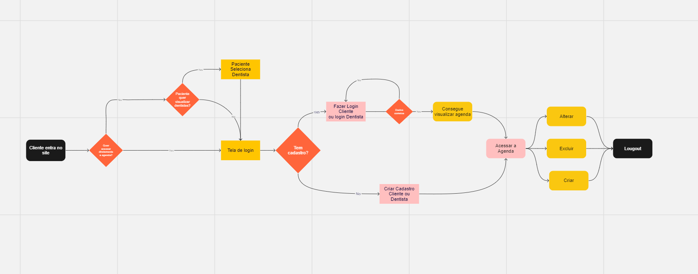
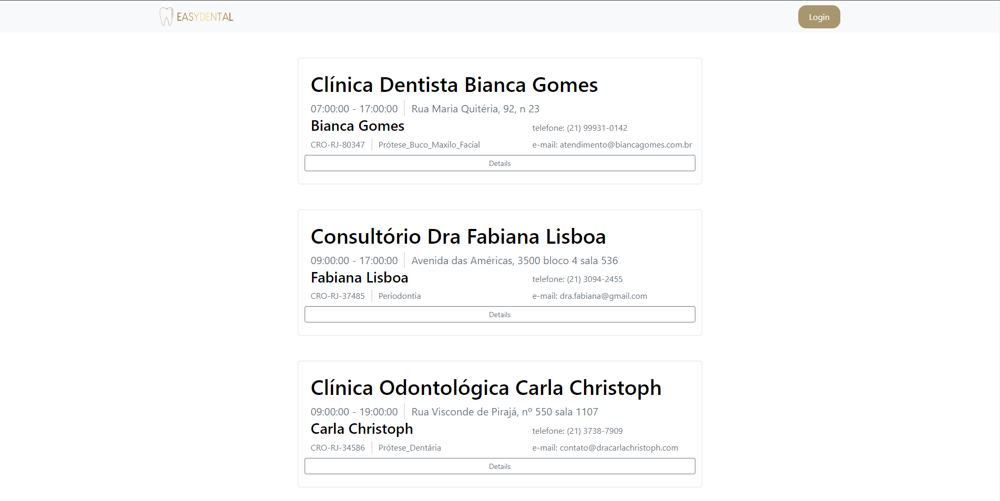
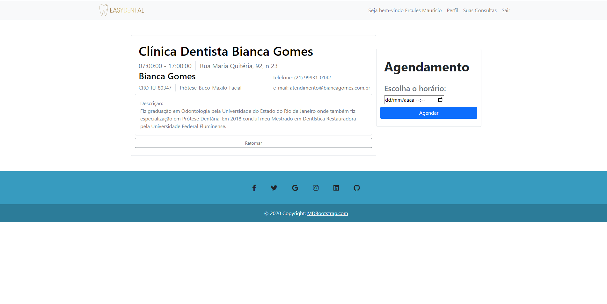

# Projeto de Interface

No contexto do design da interface do sistema, estamos priorizando aspectos como rapidez, acessibilidade e facilidade de uso. Consequentemente, o projeto adota uma identidade visual consistente em todas as telas, otimizada tanto para computadores de mesa quanto para dispositivos móveis. 

## Diagrama de Fluxo

O diagrama de fluxo é uma representação que estuda a interação do usuário com o sistema interativo, muitas vezes sem a necessidade de detalhar o design das telas da interface. Esse enfoque permite um planejamento cuidadoso do design das interações, o que impacta diretamente na qualidade do wireframe interativo que será desenvolvido em seguida. O diagrama de fluxo pode ser construído usando "caixas" que contêm informações sobre os principais elementos da interface, como menus e acessos, bem como funcionalidades como edição, pesquisa, filtragem e configurações. A conexão entre essas "caixas" (Processos Concretos)  e "Losangulos"(possiveis alteraçoes, indica um ou outra açao) : https://miro.com/app/board/uXjVNZwkV2w=/?share_link_id=53212244677

## Wireframe Interativo 

Tela Dentista

Nessa parte será possível visualizar os dentistas cadastrados, e visualizar suas especialidades, será possível através de uma barra lateral filtrar por localidade e especialidade. Para acessar mais informações do dentista ele irá para a próxima tela a seguir.   

Tela mais informações sobre o Dentista 

Nessa parte será possível visualizar com mais detalhes as informações do dentista e também haverá um botão para agendar com o profissional. 

Tela Entrar 

Nessa parte o usuário necessitara de um cadastro para poder acessar o sistema, caso ele já seja cadastrado poderá entrar com seu e-mail e senha. Caso ele esqueça a senha basta deixar o Email que foi cadastrado no campo correspondente e clicar no esqueci a senha. Nessa página irá ter a possibilidade de clicar em um botão para cadastro que será diferente para paciente e dentistas. 

Tela Cadastro paciente 

Nessa tela será possível fazer o cadastro do Paciente com as informações de nome, telefone, Email e senha. Caso as informações estejam de acordo o cadastro será concluído com sucesso. 

Tela Cadastro dentista 

Nessa parte será possível o profissional dentista realizar o seu cadastro, colocando as seguintes informações obrigatórias: Nome completo, especialidade, número de cro, número de telefone, nome da clínica, endereço da clínica, e-mail e senha. 

