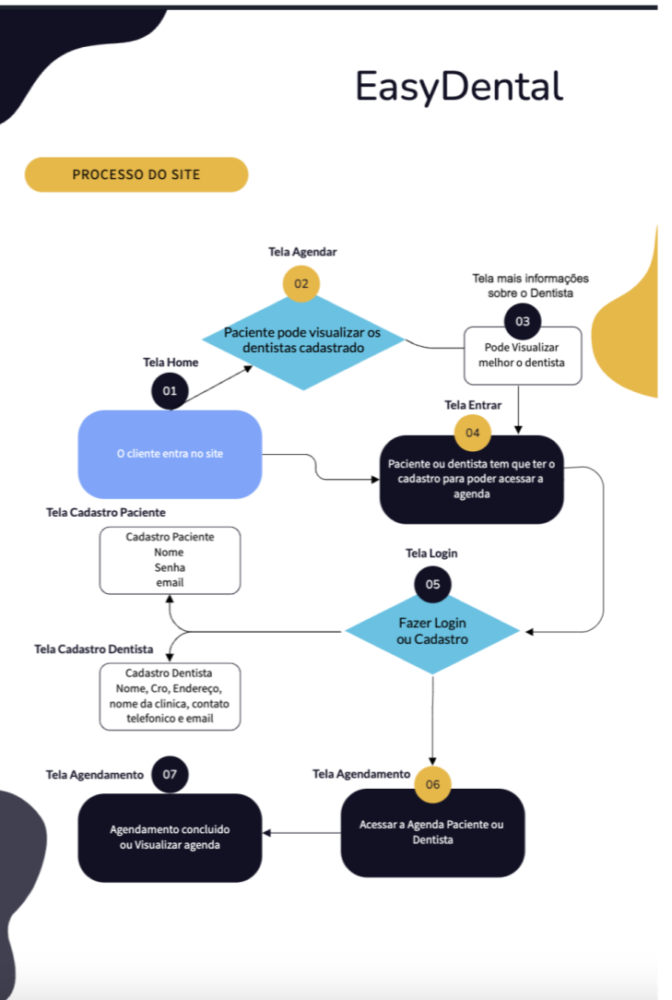
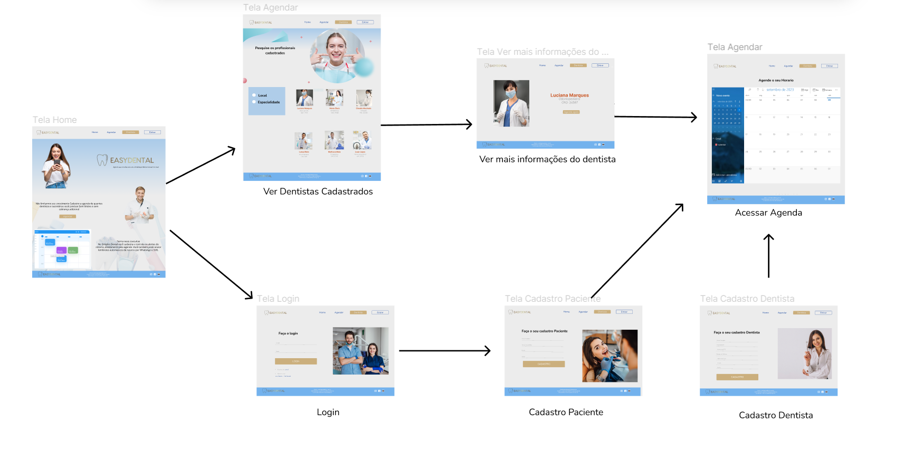

# Projeto de Interface

Pré-requisitos: <a href="2-Especificação do Projeto.md"> Documentação de Especificação</a>

No contexto do design da interface do sistema, estamos priorizando aspectos como rapidez, acessibilidade e facilidade de uso. Consequentemente, o projeto adota uma identidade visual consistente em todas as telas, otimizada tanto para computadores de mesa quanto para dispositivos móveis. 

## Diagrama de Fluxo

O diagrama de fluxo é uma representação que estuda a interação do usuário com o sistema interativo, muitas vezes sem a necessidade de detalhar o design das telas da interface. Esse enfoque permite um planejamento cuidadoso do design das interações, o que impacta diretamente na qualidade do wireframe interativo que será desenvolvido em seguida. O diagrama de fluxo pode ser construído usando "caixas" que contêm informações sobre os principais elementos da interface, como menus e acessos, bem como funcionalidades como edição, pesquisa, filtragem e configurações. A conexão entre essas "caixas" representa o fluxo de interação entre os processos. Para mais informações e exemplos, você pode consultar o seguinte: (https://www.figma.com/file/zMu1LGM81gEggICDv1YWJn/Projeto-Final-(Copy)?type=design&node-id=0%3A1&mode=design&t=uxCIfaEFFpohJFHT-1 )

## Wireframe Interativo 

Conforme o diagrama de fluxo do projeto, apresentado no item anterior, as telas do sistema são apresentadas em detalhes nos itens que se seguem. Para visualizar o wireframe interativo, acesse o  

As telas do sistema apresentam uma estrutura comum que é apresentada na Figura 4. Nesta estrutura, será distribuída em 2 blocos menores, e 1 grande bloco, descritos a seguir. São eles: 

Header - local onde são dispostos elementos fixos de identidade (logo) e navegação principal do site (menu da aplicação); 

Body - apresenta o conteúdo da tela em questão; 

Footer - apresenta os elementos de navegação secundária, geralmente associados aos elementos do bloco de conteúdo. 

Tela - Home-Page 

A tela de home-page mostra informações de como funcionaria o sistema e sendo possível começar a navegação. As imagens serão atrativas para captar a atenção do nosso público alvo.  

Tela Agendar 

Nessa parte será possível visualizar os dentistas cadastrados, e visualizar suas especialidades, será possível através de uma barra lateral filtrar por localidade e especialidade. Para acessar mais informações do dentista ele irá para a próxima tela a seguir.   

Tela mais informações sobre o Dentista 

Nessa parte será possível visualizar com mais detalhes as informações do dentista e também haverá um botão para agendar com o profissional. 

Tela Entrar 

Nessa parte o usuário necessitara de um cadastro para poder acessar o sistema, caso ele já seja cadastrado poderá entrar com seu e-mail e senha. Caso ele esqueça a senha basta deixar o Email que foi cadastrado no campo correspondente e clicar no esqueci a senha. Nessa página irá ter a possibilidade de clicar em um botão para cadastro que será diferente para paciente e dentistas. 

Tela Cadastro paciente 

Nessa tela será possível fazer o cadastro do Paciente com as informações de nome, telefone, Email e senha. Caso as informações estejam de acordo o cadastro será concluído com sucesso. 

Tela Cadastro dentista 

Nessa parte será possível o profissional dentista realizar o seu cadastro, colocando as seguintes informações obrigatórias: Nome completo, especialidade, número de cro, número de telefone, nome da clínica, endereço da clínica, e-mail e senha. 

Tela Agendamento 

Depois que o paciente ou dentista estiverem logados eles terão acesso a agenda onde mostrara as consultas agendadas com os pacientes. Pacientes só visualizaram informações dos dentistas e horários e os dentistas poderão ver as informações de cadastro no próprio calendário. 

