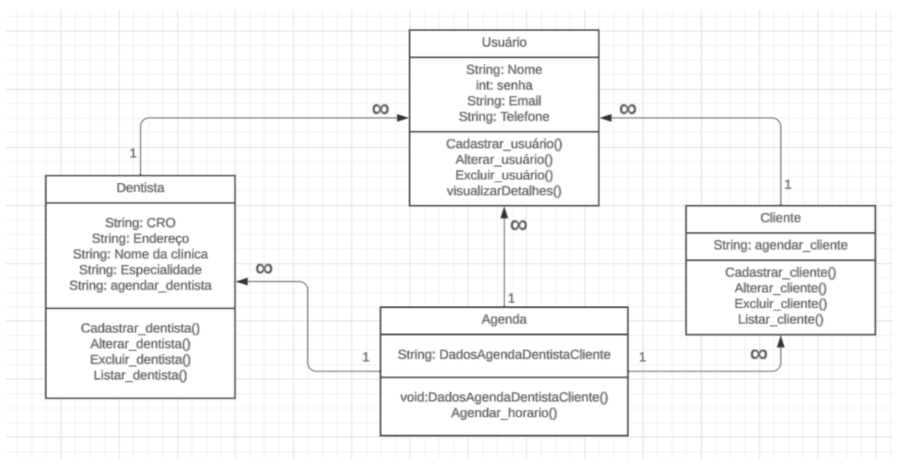
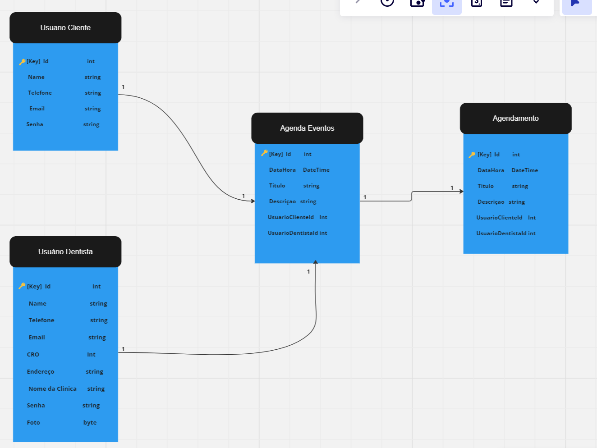
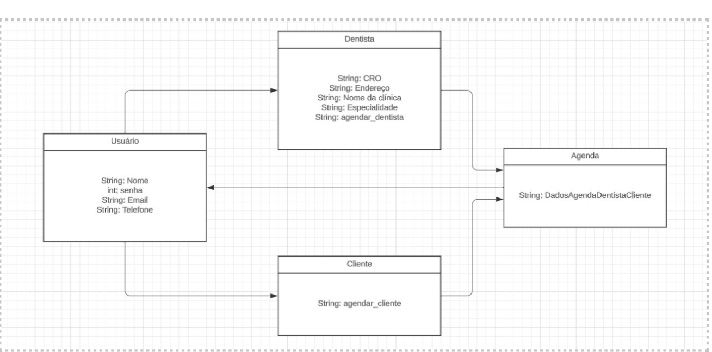

# Arquitetura da Solução

Nesta seção são apresentados os detalhes técnicos da solução criada pela equipe, tratando dos componentes que fazem parte da solução e do ambiente de hospedagem da solução. 

## Diagrama de Classes

O diagrama de classes é uma representação visual da estrutura de um software. Ele mostra as classes do software, como elas se relacionam e quais são as características de cada classe. As classes são modelos de objetos que serão criados na memória durante a execução do software.

Abaixo mostrando o diagrama de classe do projeto:

## Modelo ER (Projeto Conceitual)

O Modelo ER é um diagrama que representa as relações entre entidades em uma aplicação interativa. As entidades são coisas ou objetos que são relevantes para o domínio da aplicação.

Abaixo pode-se observar como funcionara nosso site atraves do diagrama de Entidade e Relacionamento:

## Projeto da Base de Dados

A Figura a seguir apresenta os componentes que fazem parte da solução.

O projeto da base de dados é a representação das entidades e relacionamentos identificados no Modelo ER, no formato de tabelas. As tabelas devem ter colunas e chaves primárias/estrangeiras que representem corretamente as restrições de integridade.

## Tecnologias Utilizadas

A solução implementada conta com os seguintes módulos: 

* Página Web - Conjunto de arquivos HTML, CSS, JavaScript e imagens que implementam as funcionalidades do sistema. 

* Cadastro_Dentista – Onde o dentista realizará o seu cadastro. 

* Cadastro_Cliente – Onde o Cliente realizará o seu cadastro. 

* Agenda – Onde o cliente e o dentista realizaram o agendamento dos serviços. 

* Back-end – Onde a interface conecta ao banco de dados. 

* SGBD – O sistema gerenciador de banco de dados.  

## Hospedagem

Hospedagem 

O site utiliza a plataforma do Vercel como ambiente de hospedagem do site do projeto. O site é mantido no ambiente da URL:https://easydental.vercel.app 