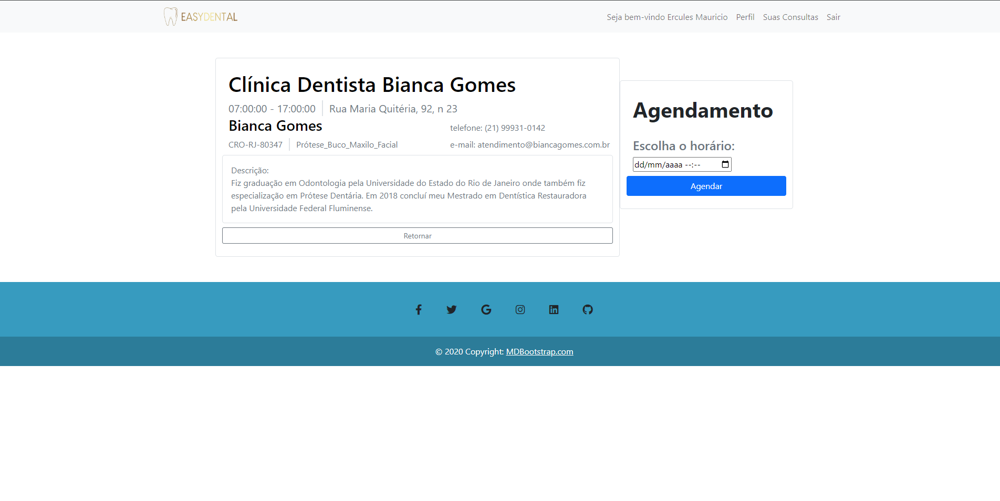

# Template Padrão da Aplicação

Template do Site 

O padrão de layout a ser utilizado pelo site tem correspondência ao projeto de Interface elaborado anteriormente, conforme Figura 05. 

O template criado está disponível no site https://www.figma.com/file/j8f1c93Odr0cVKPrZHeUSz/Projeto-Final?node-id=0%3A1&t=blsZrlSYQwIUruCI-1. e é composto pelos seguintes layouts:  

* Tela principal 

* A responsividade segue o padrão do Bootstrap 

* Tela Agendar  

È possivel visualizar as datas e horarios  disponiveis. Somente se o paciente ou dentista tiver o cadastro 

* Tela Dentistas  

Local aonde os pacientes poderam ver os dentistas cadastrados 

* Tela Login Paciente 

É possivel o paciente fazer o cadastro  

* Tela Login Dentista 

É possivel o Dentista fazer o cadastro  

Tela Entrar 

È possivel entrar no sistema

