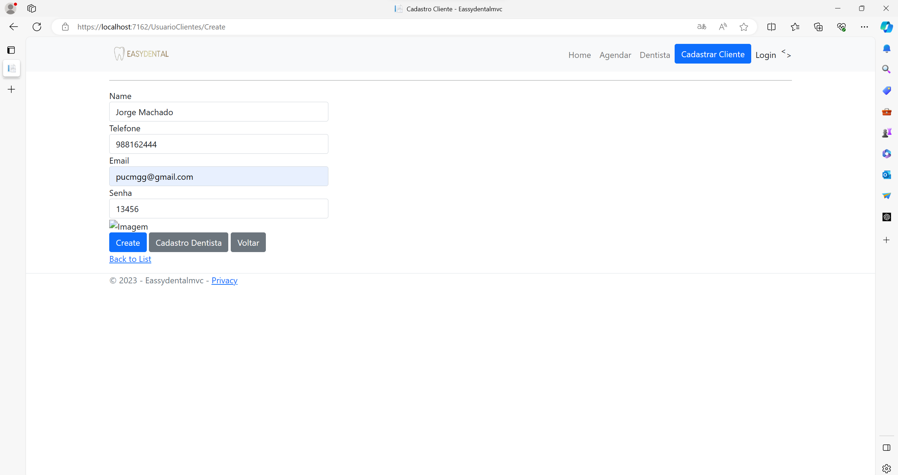
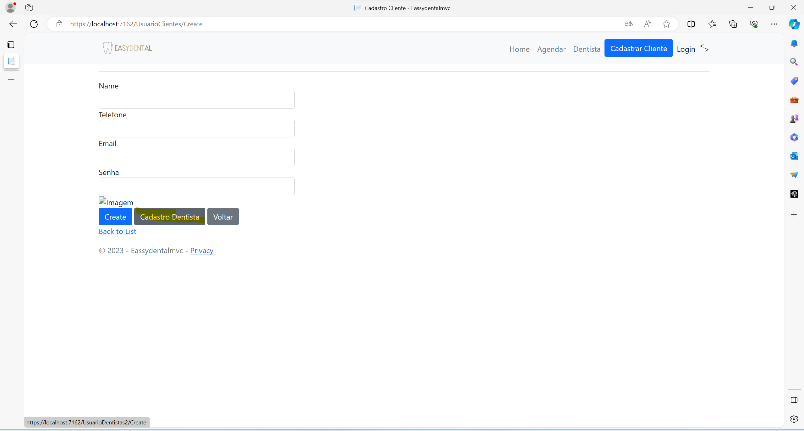
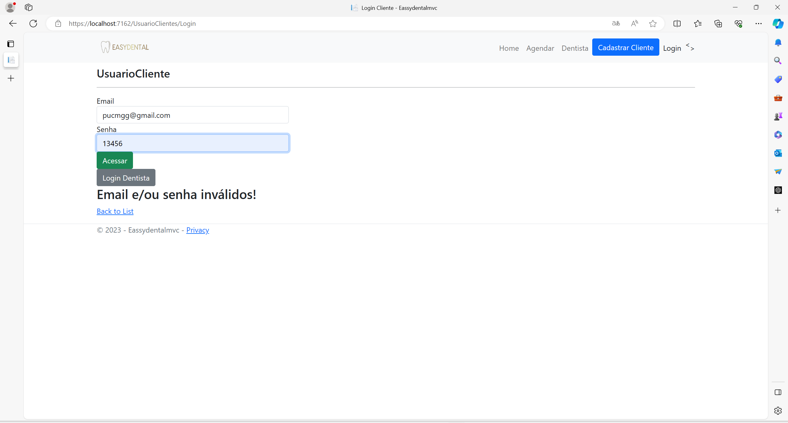
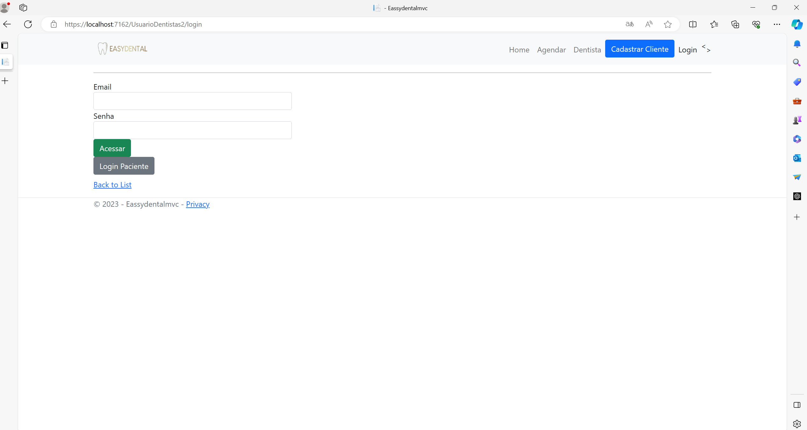

# Programação de Funcionalidades

Funcionalidades do Sistema (Telas) 

Nesta seção são apresentadas as telas desenvolvidas para cada uma das funcionalidades do sistema. O respectivo endereço (URL) e outras orientações de acesso são são apresentadas na sequência.

*Fazer Cadastro(RF-01 e RF-02) 

Nessas duas Telas o cliente é capaz de cadastrar no sistema

* Requisitos atendidos 

RF-01 

RF-02 

 

* Artefatos da funcionalidade 

Creat.html 

 

Instruções de acesso 

Faça o download do arquivo do projeto (ZIP) ou clone do projeto no GitHub; 

Descompacte o arquivo em uma pasta específica; 

Abra o Visual Studio Code e execute o Live Server;
Abra um navegador de Internet e informe a seguinte URL:  https://localhost:7162/

* Pesquisa de Notícias (RF-04 RF-05) 

Nessa tela o cliente ( Paciente ou Dentista) será capaz de fazer login no sistema.

* Artefatos da funcionalidade 

login.html 

 

* Instruções de acesso 

Faça o download do arquivo do projeto (ZIP) ou clone do projeto no GitHub; 

Descompacte o arquivo em uma pasta específica; 

Abra o Visual Studio Code e execute o Live Server;
Abra um navegador de Internet e informe a seguinte URL:  https://localhost:7162/

* Pesquisa de Notícias (RNF-01 RNF-03) 

A Tela Home já se encontra responsiva e segue um padrao de designer. 

 

 

* Requisitos atendidos 

RNF-01 -  

RNF-02 -  

 

* Artefatos da funcionalidade 

Index.html 

 

 

Instruções de acesso 

* Instruções de acesso 

Faça o download do arquivo do projeto (ZIP) ou clone do projeto no GitHub; 

Descompacte o arquivo em uma pasta específica; 

Abra o Visual Studio Code e execute o Live Server;
Abra um navegador de Internet e informe a seguinte URL:  https://localhost:7162/
