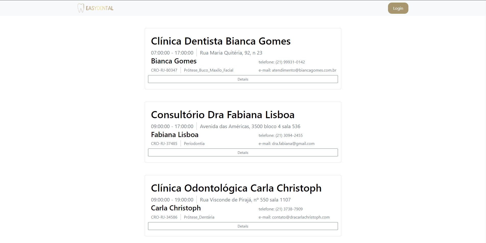

# Programação de Funcionalidades

Funcionalidades do Sistema (Telas) 

Nesta seção são apresentadas as telas desenvolvidas para cada uma das funcionalidades do sistema. O respectivo endereço (URL) e outras orientações de acesso são apresentadas na sequência.

* Fazer Cadastro (RF-01 e RF-02) 

Nas telas a seguir o cliente e o dentista é capaz de se cadastrar no sistema

* Requisitos atendidos 

RF-01 

RF-02 

* Artefatos da funcionalidade 

/UsuarioClientes/Create

/UsuarioDentistas/Create
 
* Instruções de acesso 

Acesse o site https://eassydental.azurewebsites.net/, clique no botão de login e em registre agora

* Fazer Login (RF-03 RF-04) 

Nas telas a seguir o cliente e o dentista é capaz de se logar ao sistema

* Requisitos atendidos 

RF-03 

RF-04 

* Artefatos da funcionalidade 

/UsuarioClientes/Login

/UsuarioDentistas/Login

* Instruções de acesso 

Acesse o site https://eassydental.azurewebsites.net/ e clique no botão de login

* Visualizar lista de Dentistas (RF-05) 

Na tela a seguir os usuários são capazes de visualizar a lista de dentistas

* Requisitos atendidos 

RF-05

* Artefatos da funcionalidade 

/UsuarioDentistas/Index

* Instruções de acesso 

Acesse o site https://eassydental.azurewebsites.net/ e será redirecionado diretamente na lista de dentistas

* Visualizar detalhes do Dentista (RF-06) 

Na tela a seguir os usuários são capazes de visualizar os detalhes do dentista

* Requisitos atendidos 

RF-06

* Artefatos da funcionalidade 

/UsuarioDentistas/Details/{id}

* Instruções de acesso 

Acesse o site https://eassydental.azurewebsites.net/ e escolha um dentista da lista de dentistas