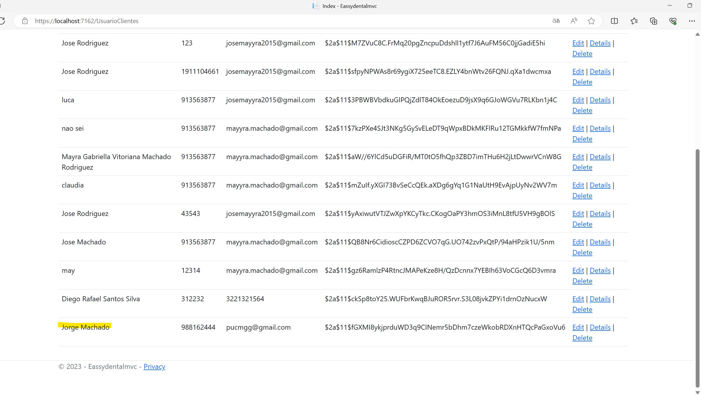
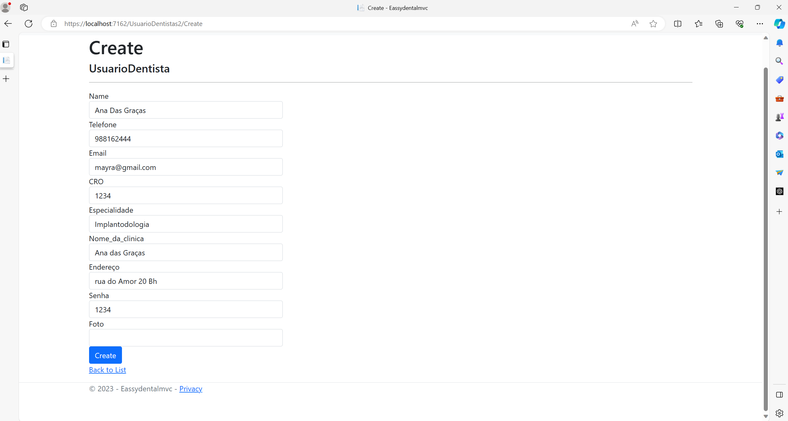
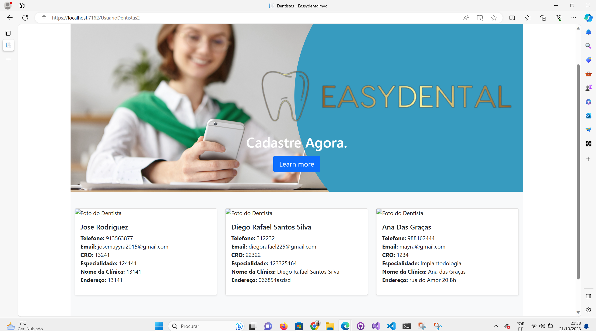
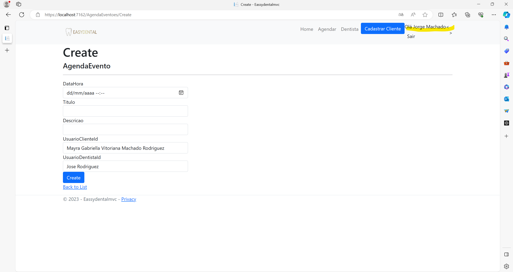
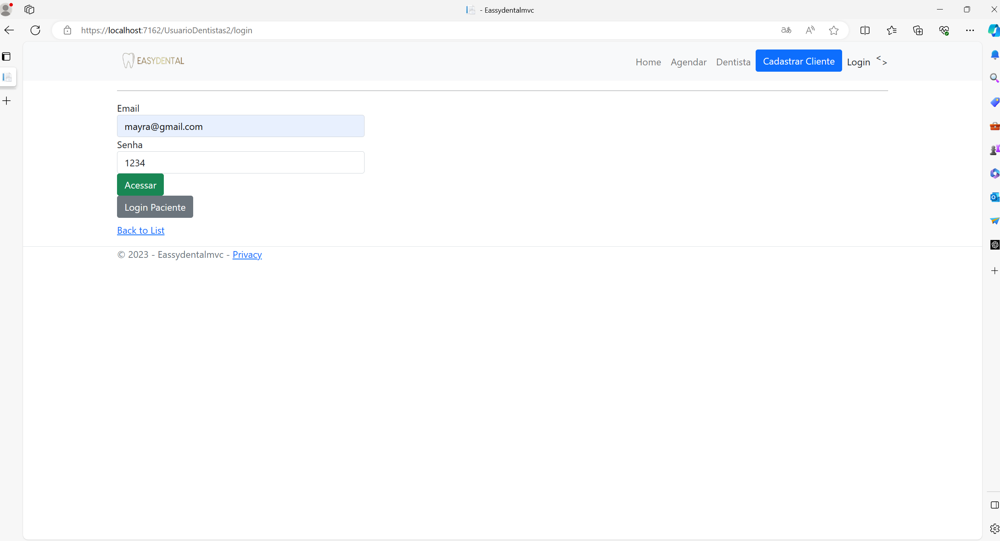
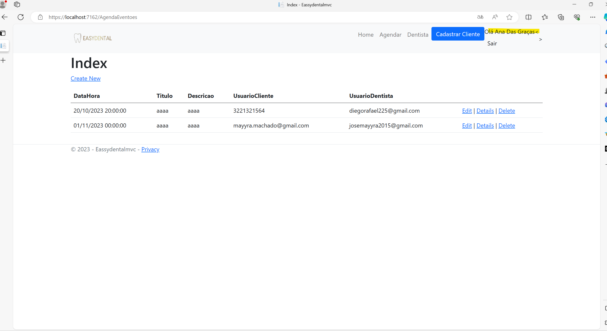

# Registro de Testes de Software

Instruções de acesso 

Faça o download do arquivo do projeto (ZIP) ou clone do projeto no GitHub; 

Descompacte o arquivo em uma pasta específica; 

Abra o Visual Studio Code e execute o Live Server; 

Abra um navegador de Internet e informe a seguinte URL: 
https://localhost:7162/

* Registro de Testes de Software 

Os resultados obtidos nos testes de software realizados são descritos abaixo. 

 

*CT-01 – Cadastrar Cliente 

1) Acessar a página home do site. 

2) Navegar até a seção "Cadastro Cliente". 

3) Preencher todos os campos do formulário. 

4) Clicar em confirmar cadastro. 

5) Cadastro realizado com sucesso. 

* CT-02 – Cadastrar Cliente 

1) Acessar a página home do site. 

2) Navegar até a seção "Cadastro Cliente". 

3) Navegar até a seçao "Cadastro Dentista"

4) Preencher todos os campos do formulário. 

5) Clicar em confirmar cadastro. 

6) Cadastro realizado com sucesso. 

*CT-03 – Login Cliente

1) Acessar a página home do site. 

2) Navegar até a seçao "Login"

3) Preencher todos os campos do formulário. 

4) Clicar em confirmar acessar. 

5) Cadastro realizado com sucesso. 

6) Pode sair. 

*CT-04 – Login Cliente

1) Acessar a página home do site. 

2) Navegar até a seção "Login". 

3) Navegar até a seção "Login Dentista". 

4) Preencher todos os campos do formulário. 

5) Clicar em acessar. 

6) Cadastro realizado com sucesso. 

7) Pode sair. 

