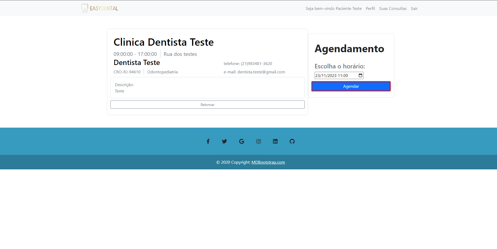

# Registro de Testes de Software

Os resultados obtidos nos testes de software realizados são descritos abaixo.

Instruções de acesso 

Acesse o site https://eassydental.azurewebsites.net/

# CT-01 – Cadastrar Cliente 

* Passos: 

1 Acessar o Site 

2 Acessar a página de cadastro do cliente

3 Preencher campos de cadastro do cliente 

4 Clicar em confirmar cadastro

* Critérios de Êxito:

# CT-02 – Cadastrar Dentista 

* Passos: 

1 Acessar o Site 

2 Acessar a página de cadastro do dentista

3 Preencher campos de cadastro do dentista 

4 Clicar em confirmar cadastro

* Critérios de Êxito:

# CT-03 – Fazer login 

* Passos:  

1 Acessar o Site 

2 Acessar a página de login

3 Preencher e-mail e senha corretos 

4 Clicar em fazer login

* Critérios de Êxito:

# CT-04 – Visualizar lista de dentistas

* Passos:  

1 Acessar o Site

* Critérios de Êxito:

# CT-05 – Visualizar detalhes de um dentista 

* Passos:

1 Acessar o Site

2 Selecionar dentista

* Critérios de Êxito:

# CT-06 – Agendar horário com um dentista

* Passos:  

1 Acessar o Site

2 Fazer login como cliente

3 Selecionar dentista

4 Preencher o dia e a hora

5 Clicar em agendar

* Critérios de Êxito:

# CT-07 – Visualizar horários marcados como cliente

* Passos:  

1 Acessar o Site 

2 Fazer login como cliente

3 Acessar a página de consultas

* Critérios de Êxito:

# CT-08 – Visualizar horários marcados pelos clientes

* Passos:  

1 Acessar o Site 

2 Fazer login como dentista

3 Acessar a página de consultas

* Critérios de Êxito:

