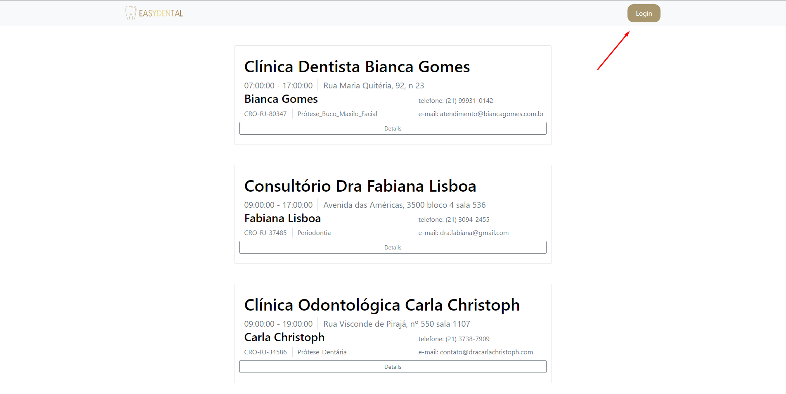
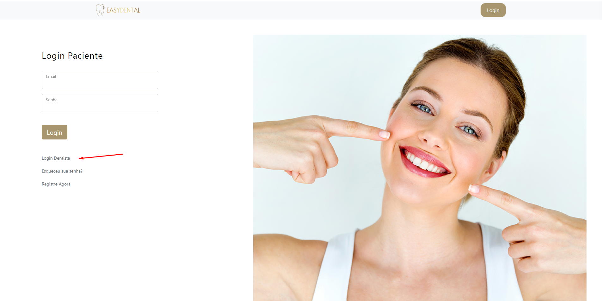
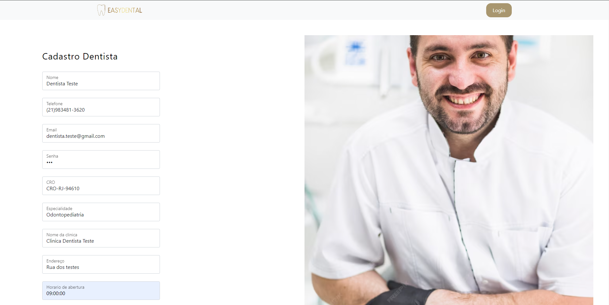

# Registro de Testes de Usabilidade

Os resultados obtidos nos testes de usabilidade realizados são descritos abaixo.

Instruções de acesso 

Acesse o site https://eassydental.azurewebsites.net/

# Cadastro de Cliente: 

* Objetivo: Avaliar a facilidade e a eficácia do processo de cadastro de um cliente.

# Cadastro de Dentista:  

* Objetivo: Avaliar a eficiência do processo de cadastro de um dentista.

# Login de Cliente e Dentista:  

* Objetivo: Testar a funcionalidade de login do sistema.

